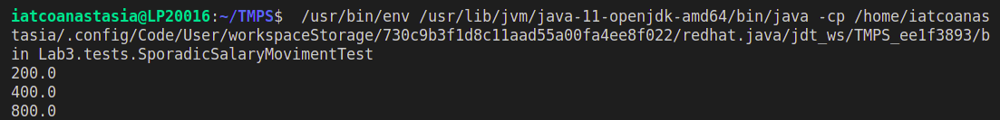
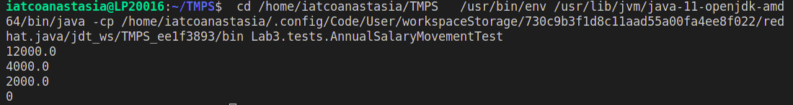

# Laboratory work №3. Behavioral Design Patterns

### Course: Software Design Techniques and Mechanisms
### Author: Iatco Anastasia, FAF-202

### More About the Domain
It's a dummy financial management module with some business rules that allows to implement some of the main behavioral design patterns.

## Wich rules and what patterns are implemented here?
### First rule: sporadic salary movement (implemented with ``Strategy`` pattern)
The sporadic salary movement is based on job level of an employee
- beginner: 20% of the actual salary
- intermediary: 40% of the actual salary
- advanced: 80% of the actual salary

``Strategy`` is a behavioral design pattern that lets you define a family of algorithms, put each of them into a separate class, and make their objects interchangeable. In Strategy pattern, a class behavior or its algorithm can be changed at run time. In Strategy pattern, we create objects which represent various strategies and a context object whose behavior varies as per its strategy object. The strategy object changes the executing algorithm of the context object.

### Example
We defined a class ``SporadicSalaryMovementCalculator``, which claculates the salary of the employee taking into consideration the job level (begginer [x0.2], intermediate [x0.4] or advanced [x0.8]). 
```java
public class SporadicSalaryMovementCalculator {

    public static BigDecimal calculate(BigDecimal salary, JobLevel jobLevel){
        return jobLevel.calculateSalaryMovement(salary);
    }
}
```
Here is an example of how salary for Intermediate level is calculated (in the same way I calculated for Begginer and Advanced level): 
```java
public class Intermediary implements JobLevel {
    @Override
    public BigDecimal calculateSalaryMovement(BigDecimal salary) {
        return salary.multiply(new BigDecimal("0.4"));
    }
}
```

### Second rule: annual salary movement (implemented with ``Chain of Responsability`` and ``Template Method`` pattern)
There are some criteria for defining annual salary movements. This criateria has a priority rule between them. 
The annual salary movement must be based, first, by salary amount

> If employee receive 20k or more per month, his annual movement must be 60%

Second, by level

> If employee has an advanced or intermediary level, must receive 40% more per year

Third, by time of contribution

> If employee has more than one year of contribution, he must receive 20% more

Fourth

> If employee does not match any of this criteria, doesn't receive annual movement

An employee can't receive the benefits of more than one criteria

``Chain of responsibility`` pattern is used to achieve loose coupling in software design where a request from the client is passed to a chain of objects to process them. Later, the object in the chain will decide themselves who will be processing the request and whether the request is required to be sent to the next object in the chain or not.

``Template method`` design pattern is to define an algorithm as a skeleton of operations and leave the details to be implemented by the child classes. The overall structure and sequence of the algorithm are preserved by the parent class. 

### Example
For instance, we declared the class ``AnnualSalaryMovement`` which calculates the salary. In dependency if there is a condition to make movement, it calculates the salary and multiplies it with the percentage applied to movement. If there is no such condition, it just calculates the salary movement for the employee.
```java
public abstract class AnnualSalaryMovement {
    protected AnnualSalaryMovement next;

    public AnnualSalaryMovement(AnnualSalaryMovement next) {
        this.next = next;
    }

    public abstract boolean conditionToMakeMovement(Employee employee);

    public abstract BigDecimal obtainPercentageAppliedToMovement();

    public BigDecimal calculateSalaryMovementFor(Employee employee){
        if(conditionToMakeMovement(employee)){
            return employee.getSalary().multiply(obtainPercentageAppliedToMovement());
        }
        return next.calculateSalaryMovementFor(employee);
    }
}
```

### Third rule: job level specification (implemented with ``State patern``)
Every job level has a specification: bronze, silver or gold
These specifications are part of a sublevel division and can change by promotion
Bronze to Silver

> Employee receive a salary movement of 20%

Silver to Gold

> Employee receive a salary movement of 40%

Gold to anything

> Can't happen

In ``State pattern`` a class behavior changes based on its state. This type of design pattern comes under behavior pattern. In State pattern, we create objects which represent various states and a context object whose behavior varies as its state object changes.

###Example
For this one I created a class ``JobLevelSpecification`` which can update the employee's level. I has 3 child classes (Bronze, Silver and Gold
```java
public abstract class JobLevelSpecification {

    public void updateToNextJobLevelSpecification(Employee employee) throws Exception {
        throw new Exception("Can't update to the next level");
    }
}
```

### Fourth rule: request for non-standard salary movements (implemented with ``Command`` and ``Observer``)

A manager can request for salary movement of an employee in another conditions than the specified by the system. Because of it, the system needs to have an operational flow that allows the creation of requests. The request needs to send an email and to be saved.

``Command pattern`` is a data driven design pattern and falls under behavioral pattern category. A request is wrapped under an object as command and passed to invoker object. Invoker object looks for the appropriate object which can handle this command and passes the command to the corresponding object which executes the command.

``Observer pattern`` is used when there is one-to-many relationship between objects such as if one object is modified, its depenedent objects are to be notified automatically. 

### Example
Here I created the request class ``Employee``:
```java
public class Employee {
    private JobLevel jobLevel;
    private BigDecimal salary;
    private Date startDate;
    private JobLevelSpecification jobLevelSpecification;

    public Employee(JobLevel jobLevel, BigDecimal salary, Date startDate) {
        this.jobLevel = jobLevel;
        this.salary = salary;
        this.startDate = startDate;
    }

    public Employee(JobLevel jobLevel, BigDecimal salary, Date startDate, JobLevelSpecification jobLevelSpecification) {
        this.jobLevel = jobLevel;
        this.salary = salary;
        this.startDate = startDate;
        this.jobLevelSpecification = jobLevelSpecification;
    }

    public JobLevel getJobLevel() {
        return jobLevel;
    }

    public BigDecimal getSalary() {
        return salary;
    }

    public void setSalary(BigDecimal salary) {
        this.salary = salary;
    }

    public void setJobLevelSpecification(JobLevelSpecification jobLevelSpecification) {
        this.jobLevelSpecification = jobLevelSpecification;
    }

    public int getContributionTimeInYears(){
        LocalDate startLocalDate = startDate.toInstant().atZone(ZoneId.systemDefault()).toLocalDate();
        Period period = Period.between(startLocalDate, LocalDate.now());
        return period.getYears();
    }

    public String obtainJobLevelSpecificationName(){
        return jobLevelSpecification.getClass().getSimpleName();
    }
}
```

## Conclusions

These are the main behavioral design patterns that I have listed here.
Here can be seen the results of runnin some tests:

